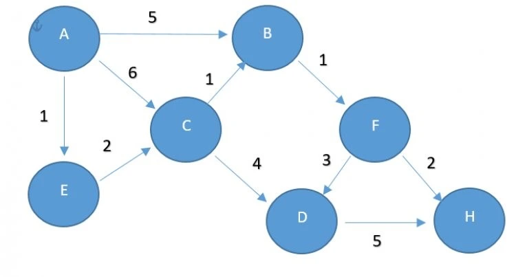

# 📌 Shortest Path

This project is developed to find the shortest path between two points. The user defines nodes and edges in a graph structure. Then, using the Dijkstra algorithm, the shortest path and its total distance between two points are calculated.

#  What is Dijkstra Algorithm?

Dijkstra algorithm finds the shortest path from a starting point to all other points in a graph. It works based on distances and is commonly used in maps, navigation, and network analysis.

# 🎯 Purpose

    Understand how Dijkstra algorithm works

    Build and manage a graph structure in Python

    Learn how to find the minimum cost path

    Use test structure, modular coding, and GitHub Actions
# 🛠️ Features

    Add nodes and edges to define a graph

    Find the shortest path and distance with Dijkstra algorithm

    Test the correctness of the algorithm with simple test cases

# ✨ Use Cases

This project is a basic Python implementation of an algorithm used in:

    Map applications
    Navigation systems
    Transportation networks
    Route planning
    Network (graph) analysis